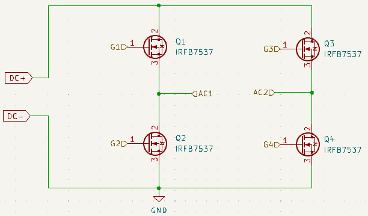
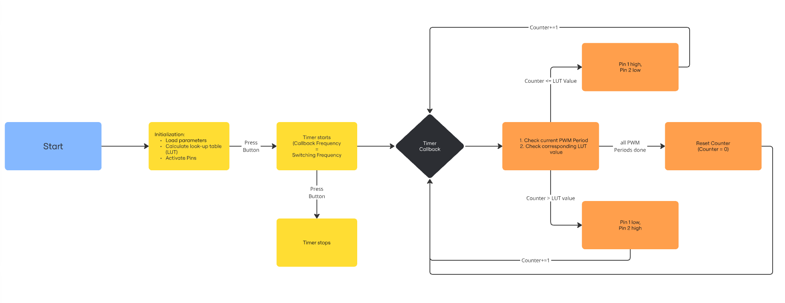
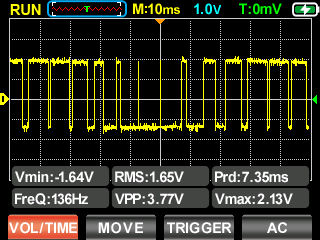
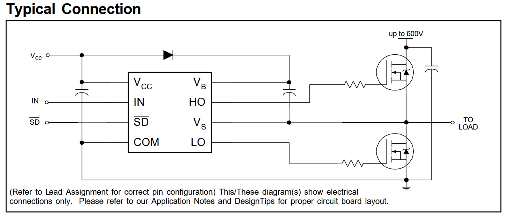

# H-Bridge Inverter 

## Goal
Basic functionality of an H-Bridge Inverter (12V DC --> 230V AC)

## Overview
1. Microcontroller (Raspi Pico) generates a sine PWM as a control signal
2. Sine PWM goes into a gate driver (Bootstrap) 
3. Bootstrap (one for each side) controls H-Bridge MOSFETs --> sine_wave AC

 

 <figure>
  
  <figcaption>Fig.1 - Simple H-Bridge </figcaption>
</figure> 

 

## Code
* based on [sPWM_Basic/sPWM_Basic.ino](https://github.com/Irev-Dev/Arduino-Atmel-sPWM/blob/d9c89ceef080a3c18ce5a02e0e310f1f46b8f579/sPWM_Basic/sPWM_Basic.ino)

### Flowchart
 <figure>
  
  <figcaption>Fig.2 - Flowchart Code </figcaption>
</figure> 

 

### Output

 <figure>
  
  <figcaption>Fig.3 - Sine PWM Output </figcaption>
</figure> 

 

## Hardware

### Why Bootstrap Circuit?
* source of high side MOSFET floats between V_AC (here: 12V AC) --> V_GS at the high side MOSFET must be high enough to safely switch on/off the MOSFET
* if low side MOSFET on, Bootstrap capacitor is chraged up to V_DC (here: 12V DC, voltage drop over bootstrap diode negligible)
* if high side MOSFET is switched on, the capacitor delivers its voltage to the control pin of the high side MOSFET

 

 <figure>
  
  <figcaption>Fig.4 - Bootstrap CIrcuit </figcaption>
</figure> 

 

### Circuit Design
* [Infineon IR2104](https://www.infineon.com/cms/de/product/power/gate-driver-ics/ir2104/) was used
* Dimensioning based on [TI Application Note](https://www.ti.com/lit/an/slua887a/slua887a.pdf?ts=1735164351528&ref_url=https%253A%252F%252Fwww.google.com%252F)
* MOSFETs: [IRFB7537](https://www.infineon.com/dgdl/Infineon-Data_Sheet_IRFS7537PBF-DS-v01_01-EN.pdf?fileId=5546d462533600a4015364c3ee2729cb)

#### Bootstrap Capacitor
$C_{boot} >= \frac{Q_{total}}{\Delta V_{HB}} = 183.75nF$  (Rule of thumb: 10 times gate capacitance leads to $190nF$) --> $C_{boot} = 200 nF$ 

$Q_{total} = Q_G + I_{HBS} \cdot \frac{D_{max}}{f_{sw}} + \frac{I_{HB}}{f_{sw}} $

* $Q_G = 210nC$ from [Data Sheet MOSFET](https://www.infineon.com/dgdl/Infineon-Data_Sheet_IRFS7537PBF-DS-v01_01-EN.pdf?fileId=5546d462533600a4015364c3ee2729cb)

* $I_{HBS} = 50 \mu A$ from [Data Sheet Gate Driver](https://www.infineon.com/cms/de/product/power/gate-driver-ics/ir2104/)

* $D_{max} = 1$ (will be slightly lower beacause of 520ns Dead time, 100% assumed for conservative caluclation)

* $f_{sw} = 10kHz$

* $I_ {HB} = 55 \mu A$ from [Data Sheet Gate Driver](https://www.infineon.com/cms/de/product/power/gate-driver-ics/ir2104/)

$\Delta V_{HB} = V_ {DD} − V_ {DH} − V_ {HBL} = 1.2V $

* $V_ {DD} = V_{DC} = 12V$

* $V_ {DH} = 1V $ from [Data Sheet 1N4148](https://www.vishay.com/docs/81857/1n4148.pdf)

* $V_{HBL} = 9.8V$ from [Data Sheet Gate Driver](https://www.infineon.com/cms/de/product/power/gate-driver-ics/ir2104/)

##### Bootstrap Resistor
$R_{boot} = \frac{V_{DD} - V_{Boot,Diode}}{I_{peak}} = 5.5 \Omega$ --> $5.6 \Omega$

* $V_{DD} = V_{DC} = 12V$

* $V_{Boot,Diode} = V_ {DH} = 1V $ from [Data Sheet 1N4148](https://www.vishay.com/docs/81857/1n4148.pdf)

* I_{peak} = I_{FSM} = 2A from [Data Sheet 1N4148](https://www.vishay.com/docs/81857/1n4148.pdf)

#### Gate Resistors
$R_{G,HS} = \frac{V_{Gate}}{I_{o+}} = 92 \Omega$ --> $91 \Omega$
* $V_{Gate} = V_{DC} = 12V$
* $I_{o+} >= 130mA $ from [Data Sheet Gate Driver](https://www.infineon.com/cms/de/product/power/gate-driver-ics/ir2104/)

$R_{G,LS} = \frac{V_{Gate}}{I_{o-}} = 44 \Omega$ --> $47 \Omega$
* $V_{Gate} = V_{DC} = 12V$
* $I_{o+} >= 270mA $ from [Data Sheet Gate Driver](https://www.infineon.com/cms/de/product/power/gate-driver-ics/ir2104/)

### Output Filter
* second order passive lowpass filter
* Cutoff frequency $f_g = \frac{1}{2 \pi \cdot \sqrt{LC}}$
* $f_g$ should be as low as possible because $f_{sin} = 50Hz$ and $f_{switch} = 10kHz$ are  

## Performance
Disclaimer: I know Micropython is not made for high performance applications, but rather for rapid prototyping and easy debugging. I still wanted to see how far I can get with Micropython and compare it to C. 
Also the C code can become much faster by shorten the timer callback, using bit operations and more. 
I am looking forward to any improvement suggestions :)

| Language |	Code Version | 	$f_{sin,set}$ in Hz | $f_{sin,real}$ in Hz |	$f_{switch,real}$ in kHz |
| ----------- | ----------- | ----------- | ----------- | ----------- | 
| MicroPython	| 26/12/2024	| 50	| 50	| 5 |  
| MicroPython	| 26/12/2024	| 100	| 100	| 10 |
| MicroPython	| 26/12/2024	| 500	| 105.3	| 10.5 |
| C	| 02/01/2025	| 50	| 50	| 5 |
| C	| 02/01/2025	| 100	| 100	| 10 |
| C	| 02/01/2025	| 500	| 444.4	| 44.4 |

## ToDos
* shorten timer callback (call for improvement proposals)
* (if inductive load: add external flyback diodes in parallel to MOSFETs)
